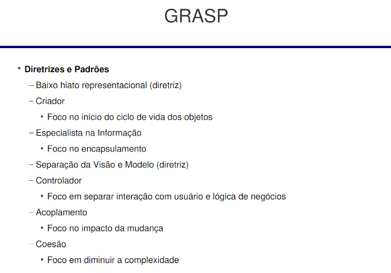

# Padrão GRASP

*Genral Responsability Assigment Software Pattern* : Projeto guiado por responsabilidades. Com 9 padrões.

**ref:** *Applying UML and Patterns*

## Padrões

GRASP foca em didática

EFC (Entidade-Fronteira-Controle) :: BCF (boundary-control-entity)

Frontier -> Controller -> Entity
------
### Baixo hiato represenciacional
Hiato: Lacuna / diferença do problema real

Ficar mais proximo do modelo de domínio

### Criador
* **Problema:** Quem cria o objeto?
* **Solução:** Delegar a criação
  
### Especialização na Informação
* **Problema:** Qual o critério para atribuir responsabilidades ao objeto?
* **Solução:** Atribuit responsabilidade ao objeto que teha informação necessaria para satisfaze-la

Lei de Demétrio

### Separação da visão e modelo (Diretriz)

### Controlador

### Acoplamento Baixo

### Coesão alta
-------------

* padrão não é inventado é descoberto.